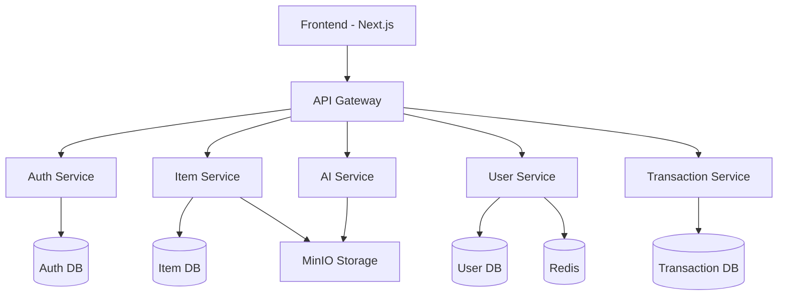

# Gloria - Sustainable Second-Hand Exchange Platform

A cloud-native marketplace platform for sustainable second-hand trading, built with modern microservices architecture.

## Architecture Overview



### Services

- **Frontend (Port 3000)**: Next.js 15 application with App Router and Server Components
- **Auth Service (Port 4001)**: User authentication and authorization
- **Item Service (Port 4002)**: Product listing and management with image handling
- **AI Service (Port 4003)**: Image processing and recommendation engine
- **User Service (Port 4004)**: User profile and preferences management
- **Transaction Service (Port 4005)**: Order and payment processing

### Infrastructure

- **PostgreSQL**: Main data store with separate databases per service
- **Redis**: Caching and session management
- **MinIO**: S3-compatible object storage for images and files
- **Docker & Docker Compose**: Container orchestration

## Prerequisites

- Node.js 20 or higher (`nvm use 20`)
- pnpm 9 or higher (`npm i -g pnpm@latest`)
- Docker Desktop with Docker Compose
- PostgreSQL client tools (`pg_isready`)
- curl (for healthchecks)

## Getting Started

1. Clone the repository and install dependencies:

   ```bash
   git clone git@github.com:Juke0406/Gloria.git
   cd Gloria
   pnpm install
   ```

2. Set up environment variables:

   ```bash
   # Copy example env files
   pnpm run setup:env

   # Edit the .env files with your configuration
   code services/auth-service/.env
   code services/item-service/.env
   ```

3. Start infrastructure and initialize databases:

   ```bash
   pnpm setup
   ```

4. Start all services in development mode:
   ```bash
   pnpm dev
   ```

## Development

### Service-specific Development

Start individual services in development mode:

```bash
# Auth Service
pnpm dev:auth

# Item Service
pnpm dev:item

# Start infrastructure only
pnpm start:infra
```

### Database Management

```bash
# Generate migrations
pnpm generate

# Run migrations
pnpm migrate

# Clean databases and volumes
pnpm clean
```

### Testing and Quality

```bash
# Run tests
pnpm test

# Lint code
pnpm lint

# Format code
pnpm format

# Check service health
pnpm check:health
```

## API Documentation

### Auth Service

- `POST /api/auth/register` - Register new user
- `POST /api/auth/login` - User login
- `GET /api/protected/user` - Get user profile

### Item Service

- `GET /api/items` - List items
- `POST /api/items` - Create item
- `GET /api/items/:id` - Get item details
- `PUT /api/items/:id` - Update item
- `DELETE /api/items/:id` - Delete item
- `POST /api/items/:id/images/upload-url` - Get image upload URL
- `POST /api/items/:id/images` - Add image to item
- `DELETE /api/items/:id/images/:key` - Remove image from item

## Environment Variables

### Auth Service

- `DATABASE_URL`: PostgreSQL connection string
- `JWT_SECRET`: Secret for JWT signing
- `PORT`: Service port (default: 4001)

### Item Service

- `DATABASE_URL`: PostgreSQL connection string
- `JWT_SECRET`: Secret for JWT validation
- `PORT`: Service port (default: 4002)
- `MINIO_ENDPOINT`: MinIO server endpoint
- `MINIO_ACCESS_KEY`: MinIO access key
- `MINIO_SECRET_KEY`: MinIO secret key
- `MINIO_BUCKET`: MinIO bucket name

## Deployment

### Docker Compose

Deploy all services:

```bash
docker-compose up -d
```

Stop and remove containers:

```bash
docker-compose down
```

### Production Deployment

1. Build services:

   ```bash
   pnpm build
   ```

2. Start with production configuration:
   ```bash
   NODE_ENV=production docker-compose -f docker-compose.yml -f docker-compose.prod.yml up -d
   ```

## Contributing

1. Fork the repository
2. Create a feature branch
3. Implement changes
4. Add tests
5. Create a pull request

## License

MIT License - see [LICENSE](LICENSE) for details
