<div align="center">
  
# 🍞 Grub

[](https://nextjs.org/)
[](https://www.typescriptlang.org/)
[](https://tailwindcss.com/)
[](https://www.docker.com/)
[](https://kubernetes.io/)


**Combat Food Waste, Save Money, Make a Difference**

_Connecting consumers with local bakeries and supermarkets to reduce food waste through discounted last-minute purchases_

[Getting Started](#setup-instructions) • [Features](#features) • [API Docs](#api-documentation) • [Contributing](#contributing)

</div>

---

Grub is a modern web application designed to combat food waste by connecting consumers with bakeries and supermarkets to purchase surplus food items at discounted prices. The platform facilitates last-minute food reservations while helping businesses reduce waste and maintain profitability.

## Overview

The application serves three main user types:

- **Consumers**: End users looking to purchase discounted food items
- **Bakeries**: Business users who can list surplus bread and bundle offerings
- **Supermarkets**: Large-scale retailers who can integrate via API to list their items

## Technical Stack

### Frontend

- Next.js 14 (App Router)
- TypeScript
- TailwindCSS
- Shadcn/ui Components
- React Query
- Zustand (State Management)

### Backend Infrastructure

- Envoy (API Gateway/Service Mesh)
- Apache Kafka & Zookeeper (Event Streaming)
- Redis (Caching/Session Management)
- PostgreSQL (Primary Database)
- Docker & Kubernetes (Containerization & Orchestration)

### Microservices Architecture


1. **Authentication Service**

   - User authentication and authorization
   - JWT token management
   - Role-based access control
   - Session management with Redis

2. **Reservation Service**

   - Handles food item reservations
   - Manages pickup windows
   - User rating system
   - Real-time availability updates

3. **Listing Service**

   - Product catalog management
   - Price management
   - Inventory tracking
   - Bundle creation and management

4. **Prediction Service**

   - Demand forecasting
   - Price optimization
   - Trend analysis
   - Integration with ML Algorithm Service

5. **Creation Service**

   - Business onboarding
   - Product creation and updates with validation
   - Bundle generation and management
   - Category management
   - Product status tracking (active, sold out, expired, draft)
   - Discount percentage calculation
   - Image validation and management

6. **ML Algorithm Service**

   - Machine learning model training
   - Predictive analytics
   - Inventory optimization
   - Sales forecasting
   - Health monitoring and reporting
   - Containerized deployment with Node.js

7. **API Management Service**
   - API versioning
   - Rate limiting
   - Documentation
   - Third-party integration management

### Message Patterns

- Event-driven architecture using Kafka
- Request-response via REST APIs
- Real-time updates via WebSocket
- Async processing for ML operations

## Features


### For Consumers

- FCFS (First Come, First Served) reservation system
- Browse available items from bakeries and supermarkets
- View discounted prices and pickup windows
- Reputation system tracking pickup reliability
- Active reservation management

### For Bakeries

- Bundle management system
- Product listing with:
  - Regular/discounted pricing
  - Sale periods
  - Pickup windows
- Dashboard with sales analytics
- ML-based inventory suggestions

### For Supermarkets

- RESTful API integration
- Bulk item listing
- Automated price adjustment system
- Real-time inventory sync

### Side Application

- Demo client for business integration
- Simulates database scanning for surplus products
- Applies discounts automatically
- Sends product data to GRUB via API
- Demonstrates API key usage

## Project Structure

```mermaid
graph TD
    Root[grub/]
    Frontend[frontend/]
    Services[services/]
    Infra[infrastructure/]
    Docs[docs/]
    Side[side_application/]

    Root --> Frontend
    Root --> Services
    Root --> Infra
    Root --> Docs
    Root --> Side

    Frontend --> App[app/]
    Frontend --> Comp[components/]
    Frontend --> Hooks[hooks/]
    Frontend --> Lib[lib/]
    Frontend --> Public[public/]

    Services --> Auth[auth-service/]
    Services --> Res[reservation-service/]
    Services --> List[listing-service/]
    Services --> Pred[prediction-service/]
    Services --> Create[creation-service/]
    Services --> ML[ml-service/]
    Services --> API[api-service/]

    Infra --> Envoy[envoy/]
    Infra --> Kafka[kafka/]
    Infra --> Redis[redis/]
    Infra --> K8s[kubernetes/]

    style Root fill:#f96,stroke:#333
    style Frontend fill:#f9f,stroke:#333
    style Services fill:#9cf,stroke:#333
    style Infra fill:#ff9,stroke:#333
    style Docs fill:#9f9,stroke:#333
    style Side fill:#f69,stroke:#333
```



```bash
grub/
├── frontend/                 # Next.js frontend application
│   ├── app/                 # App router pages
│   ├── components/          # Reusable React components
│   ├── hooks/              # Custom React hooks
│   ├── lib/                # Utility functions and store
│   └── public/             # Static assets
├── services/
│   ├── auth-service/       # Authentication microservice
│   ├── reservation-service/# Reservation management
│   ├── listing-service/    # Product listing and management
│   ├── prediction-service/ # Demand prediction and analytics
│   ├── creation-service/   # Product/bundle creation with validation
│   ├── ml-service/        # Machine learning algorithms with health monitoring
│   └── api-service/       # API gateway and management
├── infrastructure/
│   ├── envoy/             # Service mesh configuration
│   ├── kafka/             # Event streaming setup
│   ├── redis/             # Caching layer
│   └── kubernetes/        # K8s deployment configs
├── side_application/      # Demo client application for business integration
└── docs/                  # Documentation
```

## Setup Instructions

### Prerequisites

- Docker & Docker Compose
- Kubernetes cluster
- Node.js 18+
- pnpm
- kubectl

### Development Setup

1. Clone the repository

   ```bash
   git clone [repository-url]
   cd grub
   ```

2. Install frontend dependencies

   ```bash
   cd frontend
   pnpm install
   ```

3. Set up environment variables

   ```bash
   # Frontend
   cp frontend/.env.example frontend/.env.local

   # Services
   cp services/auth-service/.env.example services/auth-service/.env
   cp services/reservation-service/.env.example services/reservation-service/.env
   cp services/creation-service/.env.example services/creation-service/.env
   cp services/listing-service/.env.example services/listing-service/.env
   cp services/prediction-service/.env.example services/prediction-service/.env
   # ... repeat for other services
   ```

4. Start infrastructure services

   ```bash
   docker compose -f infrastructure/docker-compose.yml up -d
   ```

5. Deploy microservices (development)

   ```bash
   kubectl apply -f infrastructure/kubernetes/dev/
   ```

6. Run the frontend development server

   ```bash
   cd frontend
   pnpm dev
   ```

7. Set up the side application (optional)

   ```bash
   cd side_application
   python3 -m venv ./venv
   source ./venv/bin/activate
   pip install -r requirements.txt
   python3 main.py
   ```

The main application will be available at `http://localhost:3000`
The side application demo will be available at its own interface

### Production Deployment

1. Build service images

   ```bash
   docker compose -f infrastructure/docker-compose.prod.yml build
   ```

2. Deploy to Kubernetes

   ```bash
   kubectl apply -f infrastructure/kubernetes/prod/
   ```

## API Documentation

### Service APIs

All services expose RESTful APIs documented using OpenAPI (Swagger).

Base URLs:

- Auth Service: `/api/auth/v1`
- Reservation Service: `/api/reservations/v1`
- Listing Service: `/api/listings/v1`
- Prediction Service: `/api/predictions/v1`
- Creation Service: `/api/creation/v1`
- ML Service: `/api/ml/v1`

### Supermarket Integration API

Base URL: `/api/integration/v1`

#### Authentication

All API requests must include an `Authorization` header with a valid API key:

```bash
Authorization: Bearer <api_key>
```

#### Endpoints

##### List Items

```bash
POST /items/bulk
Content-Type: application/json

{
  "items": [
    {
      "sku": string,
      "name": string,
      "originalPrice": number,
      "discountedPrice": number,
      "quantity": number,
      "expiryDate": string,
      "pickupWindow": {
        "start": string,
        "end": string
      }
    }
  ]
}
```

##### Update Item Availability

```bash
PATCH /items/{sku}
Content-Type: application/json

{
  "quantity": number,
  "available": boolean
}
```

### Creation Service API

Base URL: `/api/creation/v1`

#### Product Endpoints

##### Create Product

```bash
POST /products
Content-Type: application/json

{
  "name": string,
  "description": string,
  "originalPrice": number,
  "discountedPrice": number,
  "quantity": number,
  "categories": string[],
  "images": string[],
  "expiryDate": string,
  "pickupWindow": {
    "start": string,
    "end": string
  }
}
```

##### Create Bundle

```bash
POST /bundles
Content-Type: application/json

{
  "name": string,
  "description": string,
  "originalPrice": number,
  "discountedPrice": number,
  "products": [
    {
      "productId": string,
      "quantity": number
    }
  ],
  "totalQuantity": number,
  "images": string[],
  "expiryDate": string,
  "pickupWindow": {
    "start": string,
    "end": string
  }
}
```

### Side Application Integration

The side application demonstrates how business clients can integrate with GRUB:

1. Generate an API key from the GRUB application at `/api/api-keys`
2. Configure the side application with your API key
3. Run the side application and use the demo button to send product data
4. Verify the API key usage metrics in the GRUB dashboard

## Development Guidelines

### Code Style

- Follow the ESLint configuration
- Use TypeScript strictly with no `any` types
- Follow the [Next.js App Router best practices](https://nextjs.org/docs/app)
- Implement Clean Architecture principles in microservices
- Use Domain-Driven Design where applicable

### Component Structure

- Use Shadcn/ui components for consistent UI
- Implement atomic design principles
- Create reusable components in `components/`
- Place page-specific components within their page directories

### State Management

- Use Zustand for frontend global state
- Implement React Query for server state
- Utilize React Context sparingly
- Implement Event Sourcing with Kafka
- Use Redis for distributed caching

### Git Workflow

- Feature branches should branch from `main`
- Use conventional commits
- Keep PRs focused and reasonably sized
- Ensure CI passes before merging

## Testing

### Frontend Testing

```bash
cd frontend
pnpm test        # Run unit tests
pnpm test:e2e   # Run end-to-end tests
```

### Service Testing

```bash
# Run tests for individual services
cd services/auth-service
pnpm test

cd services/reservation-service
pnpm test
# ... repeat for other services

# Run integration tests
cd infrastructure
./run-integration-tests.sh
```

### Load Testing

```bash
cd infrastructure/k6
k6 run load-tests.js
```

## Contributing

1. Fork the repository
2. Create a feature branch
3. Make your changes
4. Run tests
5. Submit a pull request
