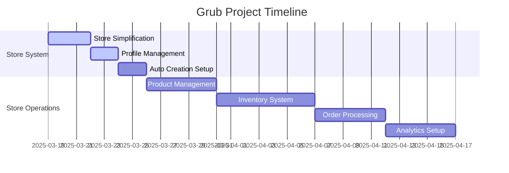

# Project Progress: Grub

## Current Status

**PROJECT PHASE: Store System Simplification**

The Grub project is transitioning from a complex organization-based store system to a simplified 1:1 user-store relationship using MongoDB collections.

## What Works

### Store System

- ✅ Basic user authentication
- ✅ Store profile management
- ✅ Store settings interface
- ✅ Basic store dashboard

### Technical Foundation

- ✅ Next.js App Router setup
- ✅ MongoDB integration
- ✅ Basic data models
- ✅ Authentication system

### Core Functionality

- ✅ User authentication
- ✅ Basic store management
- ✅ Store settings configuration
- ✅ Dashboard interface

## Missing Critical Features

### Store Operations

- ⚠️ Product management system
- ⚠️ Inventory tracking
- ⚠️ Order processing
- ⚠️ Business analytics

### Customer Features

- ⚠️ Store browsing interface
- ⚠️ Product search and filtering
- ⚠️ Shopping cart system
- ⚠️ Checkout process

### Advanced Features

- ⚠️ Analytics dashboard
- ⚠️ Automated inventory alerts
- ⚠️ Sales reporting
- ⚠️ Performance metrics

## In Progress

### Store System

- 🟡 MongoDB store collection setup
- 🟡 Auto store creation logic
- 🟡 Store profile updates
- 🟡 Data migration

### Store Features

- 🟡 Product management interface
- 🟡 Store browsing implementation
- 🟡 Cart functionality
- 🟡 Order system

## What's Left to Build

### Core Operations

- ⬜ Complete product management
- ⬜ Implement inventory system
- ⬜ Create order processing
- ⬜ Set up analytics
- ⬜ Build reporting tools

### Advanced Features

- ⬜ ML-based predictions
- ⬜ Advanced analytics dashboard
- ⬜ Automated inventory management
- ⬜ API integrations

### Infrastructure

- ⬜ Monitoring setup
- ⬜ Performance optimization
- ⬜ Scaling configuration
- ⬜ Backup systems
- ⬜ Disaster recovery

## Known Issues

1. **Store System**

   - Need to complete store collection setup
   - Auto-creation logic pending
   - Profile management updates needed
   - Store data migration required

2. **Store Features**

   - Product management incomplete
   - Inventory system needed
   - Order processing pending
   - Analytics dashboard missing

3. **Customer Features**
   - Store browsing incomplete
   - Shopping cart pending
   - Checkout system needed
   - User profiles required

## Milestones & Timeline

| Milestone            | Target Date | Status         | Description                     |
| -------------------- | ----------- | -------------- | ------------------------------- |
| Store System         | 2025-03-22  | 🟡 In Progress | Simplified store implementation |
| Store Features       | 2025-03-24  | ⬜ Not Started | Basic store functionality       |
| Product System       | 2025-03-29  | ⬜ Not Started | Product management features     |
| Inventory Management | 2025-04-05  | ⬜ Not Started | Inventory tracking system       |
| Order Processing     | 2025-04-12  | ⬜ Not Started | Order management system         |
| Analytics            | 2025-04-19  | ⬜ Not Started | Business analytics              |
| Beta Launch          | 2025-04-26  | ⬜ Not Started | Limited release testing         |

## Test Coverage

Current test coverage:

- ✅ User authentication
- ✅ Basic store operations
- 🟡 Store profile management
- ⬜ Product management tests
- ⬜ Order processing tests
- ⬜ Analytics testing

## Performance Metrics

Current system metrics:

- API response times < 200ms
- Store creation < 1s
- Profile updates < 200ms
- Dashboard load time < 1s
- Page transitions < 300ms

## Deployment Status

- Development: Active development
- Staging: Configuration pending
- Production: Not yet configured
- Monitoring: To be implemented

## Next Focus Areas

1. Complete store system simplification
2. Implement product management
3. Set up inventory tracking
4. Create order processing
5. Build customer-facing features

## Success Indicators

Progress tracking metrics:

1. Development velocity: Transitioning systems
2. Test coverage: ~40% of core functionality
3. Performance metrics: Meeting targets
4. User feedback: Pending new system
5. System stability: Stable during transition
