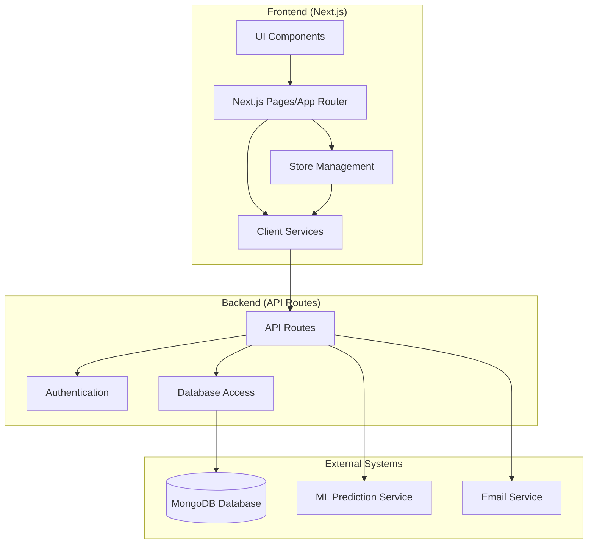
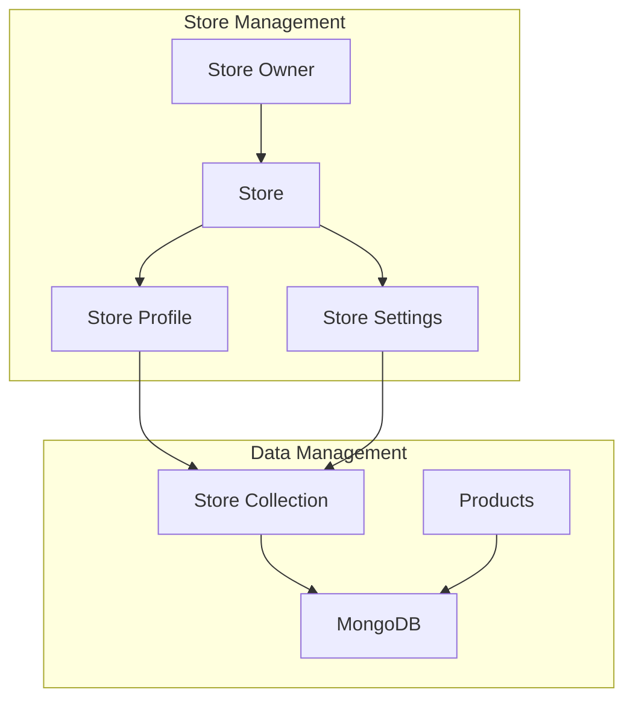
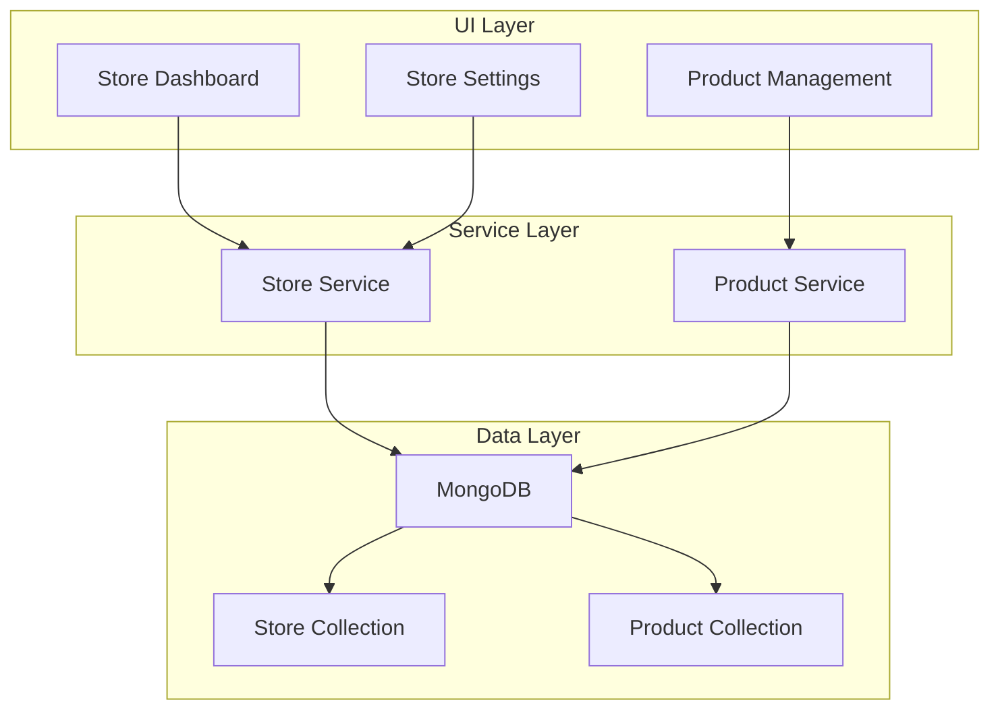
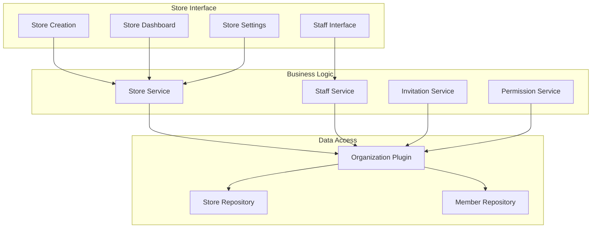
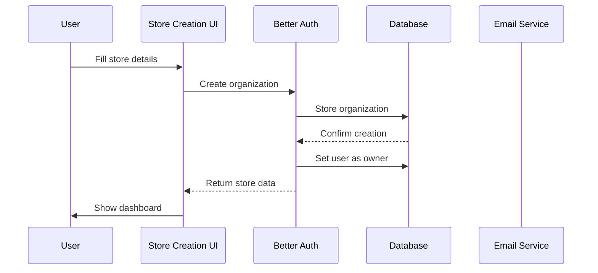
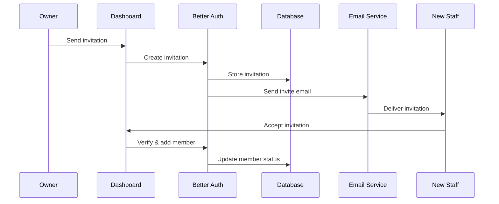

# System Patterns: Grub

## System Architecture

Grub follows a modern web application architecture with distinct frontend and backend components:

## Core Architectural Patterns

### 1. Component-Based Architecture

- Reusable UI components for consistent interfaces
- Components organized by domain (business, user, auth)
- Shared components for common functionality

### 2. Store-Based Architecture

- One store per user account
- Store profile in MongoDB collection
- Auto-creation on business portal access
- Store management through simple CRUD operations

### 3. Authentication & Authorization

- User authentication through API routes
- Store owner validation
- Simple store-specific permissions
- Basic owner-only access control

## Key Technical Decisions

### Frontend

- **Next.js Framework**: Server-side rendering and API routes
- **TypeScript**: Type safety and improved development
- **Tailwind CSS**: Utility-first styling
- **Shadcn UI**: Accessible component library
- **Better Auth Client**: Organization management

### Backend

- **Next.js API Routes**: Serverless functions
- **MongoDB**: Store and member data
- **Better Auth**: Organization plugin
- **Email Integration**: Staff invitations

## Core Design Patterns

### 1. Store Pattern

### 2. Repository Pattern

- Abstracts data access logic
- Centralized database operations
- Consistent data manipulation

### 3. Service Layer Pattern

### 4. React Hooks Pattern

- Custom hooks for store management
- State management through context
- Reusable organization logic

## Component Relationships

## Data Flow Patterns

### Store Creation Flow

### Staff Invitation Flow

## Error Handling Patterns

- Consistent error responses
- Role-based error boundaries
- Permission denial handling
- Invitation error management

## State Management

- Organization state through Better Auth
- Local UI state with React hooks
- Global app state via Context
- Server state with SWR

## Security Patterns

- Role-based access control
- Permission verification
- Secure invitation system
- Protected API routes

## Responsive Design Patterns

- Mobile-first store interfaces
- Adaptive dashboard layouts
- Responsive staff management
- Cross-device compatibility
- Adaptive dashboard layouts
- Responsive staff management
- Cross-device compatibility
